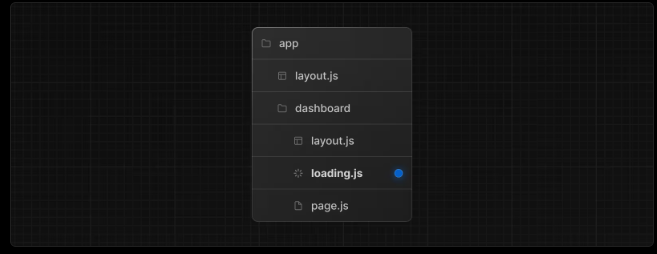

##### Loading Page

- In Next.js, a **loading page** typically refers to a page or component that is displayed temporarily while the content or data is being fetched or processed. It provides a visual indication to users that something is happening in the background and helps to improve the user experience by preventing a blank or empty screen from appearing.

  


###### Instant Loading States

- An instant loading state is fallback UI that is shown immediately upon navigation.
-  This helps users understand the app is responding and provides a better user experience.


##### Crate Loading Page

- Create a loading state by adding a `loading.js` file inside a folder.

  ```react
  //app/dashboard/loading.tsx
  export default function Loading() {
    return <div>Dashboard Loading...</div>
  }
  
  //app/dashboard/page.tsx
  import { resolve } from "path";
  export default async function Dashboard() {
    const data = await new Promise((resolve) => setTimeout(() => resolve("api done"), 3000));
    return (
      <div>
        Dashboard
      </div>
    );
  }
  ```
  





##### [Streaming with Suspense](https://nextjs.org/docs/app/building-your-application/routing/loading-ui-and-streaming#streaming-with-suspense)

- n addition to `loading.js`, you can also manually create Suspense Boundaries for your own UI components. The App Router supports streaming with


###### 

